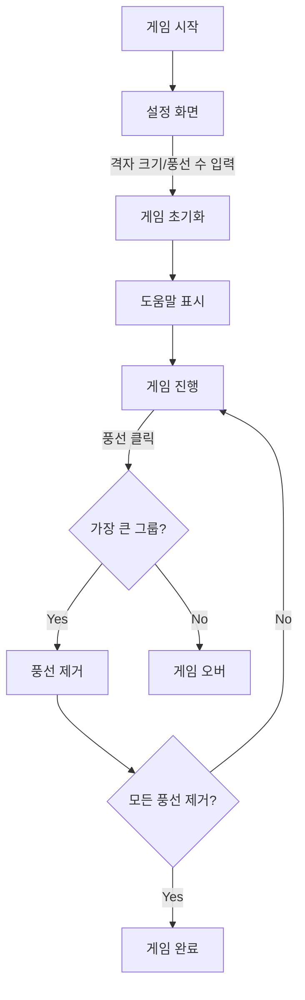

# 🎈 풍선 터트리기 게임

## 🎮 게임 플레이

- **게임 시작** 시 격자 크기(3x3 ~ 10x10)와 풍선 개수를 설정
- **풍선들이 랜덤하게 배치**
- 마우스를 **풍선 위에 올리면 연결된 모든 풍선에 호버 효과**
- **가장 큰 연결 그룹**을 찾아 **클릭**
- 모든 풍선을 **성공적으로 제거**하면 **게임 완료**

## 🔄 프로젝트 흐름도

🎯 구현 특징
DFS 알고리즘을 활용한 연결된 풍선 탐색
반응형 UI 구현
🛠️ 기술적 고민과 해결 방법
1. 연결된 풍선 탐색 알고리즘
고민
연결된 풍선을 찾는 효율적인 방법 필요
중복 방문 처리 필요

해결
DFS 알고리즘 사용
Set 자료구조를 활용한 중복 방문 처리
위치 정보를 문자열로 변환하여 효율적인 탐색 구현

2. 상태 관리
고민
게임 상태의 복잡성 증가
컴포넌트 간 상태 공유
상태 업데이트 성능

해결
Custom Hook으로 로직 분리 (useGameLogic, useGameSetup)
관심사 분리를 통한 코드 구조화
불필요한 리렌더링 방지

3. 호버 효과 구현
고민
연결된 모든 풍선에 동시에 효과 적용
성능 이슈 없이 부드러운 효과 구현

해결
Set을 활용한 효율적인 호버 상태 관리
CSS Transition 활용
Z-index 조정으로 자연스러운 시각 효과

📂 프로젝트 구조 (주요 파일)
balloon-game/ ├── public/ │ ├── index.html ├── src/ │ ├── components/ │ │ ├── BalloonBoard.tsx # 게임 격자판 관련 컴포넌트 │ │ ├── GameOver.tsx # 게임 오버 시 모달창 │ │ ├── GameRefresh.tsx # 게임 상태 관련 (새로고침, 재시작, 도움말) 컴포넌트 │ │ ├── GameSetup.tsx # 초반 게임 설정 컴포넌트 │ │ ├── HelpModal.tsx # 도움말 모달창 컴포넌트 │ │ ├── Modal.tsx # 모달창 컴포넌트 │ │ └── ScoreBoard.tsx # 스코어 보드 컴포넌트 │ ├── hooks/ │ │ ├── useGameLogic.ts # 게임 로직 관련 훅 │ │ └── useGameSetup.ts # 게임 설정 관련 훅 │ ├── utils/ │ │ ├── game.ts # 게임 관련 타입 및 로직 │ │ └── balloonLogic.ts # DFS 로직 함수 │ ├── App.tsx # 메인 컴포넌트 │ └── index.tsx # 엔트리 포인트 ├── .gitignore ├── package.json ├── README.md └── tsconfig.json
BalloonBoard.tsx - 게임 격자판 관련 컴포넌트
GameOver.tsx - 게임 오버시 모달창
GameRefresh.tsx - 게임 상태 관련 (새로고침, 재시작, 도움말) 컴포넌트
GameSetup.tsx - 초반 게임 설정 컴포넌트
HelpModal.tsx - 도움말 모달창 컴포넌트
Modal.tsx - 모달창 컴포넌트
ScoreBoard.tsx - 스코어 보드 컴포넌트
useGameLogic.ts - 게임 로직 관련 훅
useGameSetup.ts - 게임 설정 관련 훅
game.ts - 게임 관련 타입
balloonLogic.ts - DFS 로직 함수
App.tsx - 메인 컴포넌트

